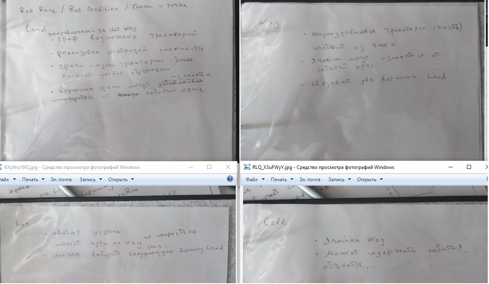

  
Словесное описание програмы включает 4 файла для 4-х классов соответственно.  
Исходного кода, который можно было бы переписывать у меня нет, так что пишу новый, в рамках игры про крыс (файлы в репозитории - реализованный дизайн).  
Хотя если рассматривать предыдущую итерацию (с задания по TDD), тест, который был не тестом изменился при сохранении словесного описания дизайна.   

Было - применение функции клетки для всех клеток пути  
def run_actions(self):  
____list(map(lambda x: x.do_action(), self.way))  

Стало - применение функции крысы для всех клеток пути  
def walk(self):  
____way = self.env.land.schedule[self.env.current][self.env.target]  
____list(map(self.inspect, way.cells))  

В процессе итерации, столкнулся с проблеммой циклического импорта и стал искать путаницу в логике.  
Из словесного описания клетки (Cell "может содержать события, объекты") я не задумываясь реализовал прохождение крысы по клетке как функцию клетки с аргументом крысы.  
Т.е. из содержания объектов я додумал вызов объектов. 
Тогда как в действительности клетка только содержит объекты, а вызывает их крыса, которая заходит на клетку.  
Также замечаю, что словесное описание Way нужно изменить - это всего лишь последовательность клеток, связывающих две вершины графа.   
А мне казалось, что в нём будет больше функций, вероятно хватит только добавления\удаления клеток.  
Итерация заняла 5 дней.  
P.S. спасибо за упоминание про не усложнять декларативщину. Я люблю обобщать и иногда увлекаюсь.  

